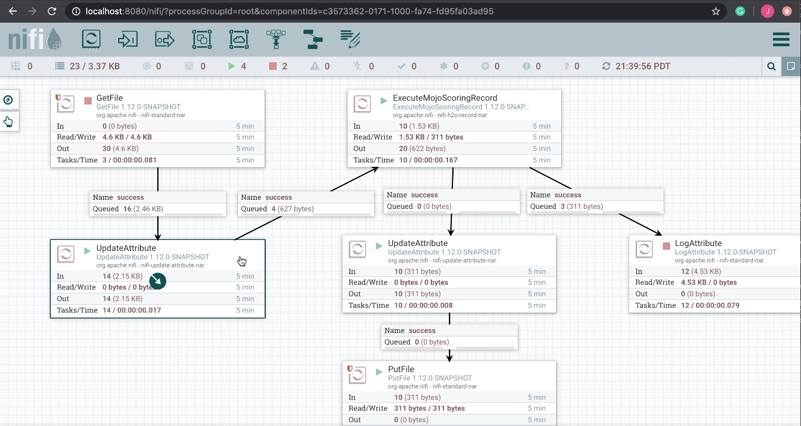
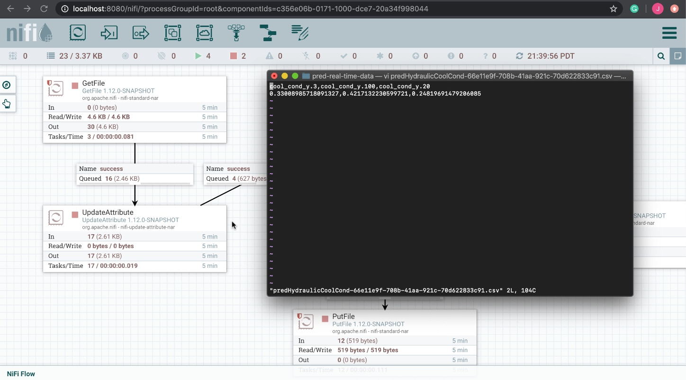
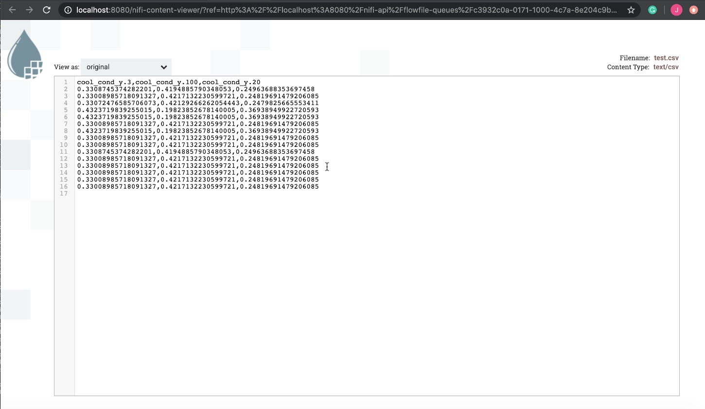

# Hydraulic System Predictive Maintenance

## Prerequisites

- Java >= 7 runtime (JDK >= 1.7)

- Hydraulic Sensor Test Data Set
    - comes with this repo under `model-deployment/common/hydraulic/testData/`

- MOJO2 Runtime JAR
    - comes with this repo under `model-deployment/common/hydraulic/mojo-scoring-pipeline/java-runtime/java/mojo2-java-runtime/mojo2-runtime.jar`

- Pipeline MOJO File
    - comes with this repo under `model-deployment/common/hydraulic/mojo-scoring-pipeline/mp-hydr-cool-cond-y/pipeline.mojo`

- Recommend Set **DRIVERLESS_AI_LICENSE_KEY** as an environment variable for OS NiFi, MiNiFi runs on
    - you will need to get Driverless AI product to get the License Key

- Anaconda or Miniconda: helpful for installing Java packages
- NiFi or MiNiFi C++
    - NiFi downloads: http://nifi.apache.org/download.html
    - MiNiFi downlaods: https://nifi.apache.org/minifi/download.html

## NiFi Interactive & Batch Scoring

There are two NiFi flow that can be built to do interactive (real-time) and batch scoring. It just depends on the data you are ingesting into the flow. If you ingest tabular data that has only 1 row of data in each file, then the ExecuteMojoScoringRecord will do real-time scoring. If you ingest tabular data that has multiple rows of data in each file, then the ExecuteMojoScoringRecord will do batch scoring.

Here are two NiFi templates:

- /Users/jmedel/Development/James/Hydraulic-System-Predictive-Maintenance/model-deployment/apps/nifi/templates/
    - PredRealTimeHydraulicCoolCond.xml
    - PredBatchHydraulicCoolCond.xml

## NiFi Interactive Scoring Flow Example

NiFi DataFlow pulls in csv data with each file containing one row of data, then updates the flow file attribute with a new attribute for schema.name = test-schema. Then real time predictions are made on the flow file for hydraulic cooling condition, the flow file's filename attribute is updated to be a unique csv filename and the flow file is stored into a csv file on the local file system. Flow file attributes can be logged too if the user turns on the log attribute processor.

Note: You will need to set the Driverless AI License Key as an evironment to use **ExecuteMojoScoringRecord** processor.

We can see the real time predictions for hydraulic cooling condition in the files saved to the file system.

## NiFi Batch Scoring Flow Example

The NiFi DataFlow will be the same as above, but the GetFile and PutFile will be different. The CSVReader that ExecuteMojoScoringRecord uses will specify that the incoming csv file has headers.

The prediction file in the terminal (or if you look at the NiFi Data Provenance event for List Queue after ExecuteMojoScoringRecord) will hold batch predictions for hydraulic cooling condition:

## Getting Help

If you need assistance with this project, please feel free to reach out and I will get back to you as soon as I can.

Also I will be making an H2O tutorial soon based on H2O Driverless AI Model Deployment to NiFi. I will share that link later.